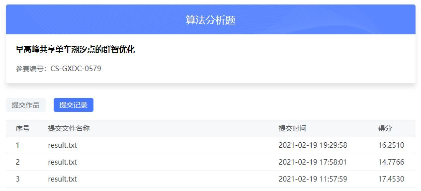

## Task2：Baseline学习及改进优化（5天）

- 学习主题：赛题解题
- 学习内容：baseline构建以及改进
- 学习成果：提交作品

## 成绩

如下图：


## Baseline

- 任务一：为更好地掌握早高峰潮汐现象的变化规律与趋势，参赛者需基于主办方提供的数据进行数据分析和计算模型构建等工作，识别出工作日早高峰07:00-09:00潮汐现象最突出的40个区域，列出各区域所包含的共享单车停车点位编号名称，并提供计算方法说明及计算模型，为下一步优化措施提供辅助支撑。

- 任务二：参赛者根据任务一Top40区域计算结果进一步设计高峰期共享单车潮汐点优化方案，通过主动引导停车用户到邻近停车点位停车，进行削峰填谷，缓解潮汐点停车位（如地铁口）的拥堵问题。允许参赛者自带训练数据，但需在参赛作品中说明所自带数据的来源及使用方式，并保证其合法合规。（城市公共自行车从业者将发生在早晚高峰时段共享单车“借不到、还不进”的问题称之为“潮汐”现象。本题涉及的“潮汐现象”聚焦“还不进”的问题，识别出早高峰共享单车最淤积的40个区域）


[Baseline代码](./baseline.ipynb) 如下：

```python
import os,codecs
import pandas as pd
import numpy as np

PATH = './data/'

/*---------读取数据---------*/
# 读取共享单车停车点位（电子围栏）数据
def bike_fence_format(s):
    s = s.replace('[', '').replace(']', '').split(',')
    s = np.array(s).astype(float).reshape(5, -1)
    return s
    
# 共享单车停车点位（电子围栏）数据
bike_fence = pd.read_csv(PATH + 'gxdc_tcd.csv')
bike_fence['FENCE_LOC'] = bike_fence['FENCE_LOC'].apply(bike_fence_format)

# 读取共享单车订单数据
bike_order = pd.read_csv(PATH + 'gxdc_dd.csv')
bike_order = bike_order.sort_values(['BICYCLE_ID', 'UPDATE_TIME'])

/*---------停车点处理---------*/
# 得出停车点 LATITUDE 范围
bike_fence['MIN_LATITUDE'] = bike_fence['FENCE_LOC'].apply(lambda x: np.min(x[:, 1]))
bike_fence['MAX_LATITUDE'] = bike_fence['FENCE_LOC'].apply(lambda x: np.max(x[:, 1]))

# 得到停车点 LONGITUDE 范围
bike_fence['MIN_LONGITUDE'] = bike_fence['FENCE_LOC'].apply(lambda x: np.min(x[:, 0]))
bike_fence['MAX_LONGITUDE'] = bike_fence['FENCE_LOC'].apply(lambda x: np.max(x[:, 0]))

from geopy.distance import geodesic
# 根据停车点 范围 计算具体的面积
bike_fence['FENCE_AREA'] = bike_fence.apply(lambda x: geodesic(
    (x['MIN_LATITUDE'], x['MIN_LONGITUDE']), (x['MAX_LATITUDE'], x['MAX_LONGITUDE'])
).meters, axis=1)

# 根据停车点 计算中心经纬度
bike_fence['FENCE_CENTER'] = bike_fence['FENCE_LOC'].apply(
    lambda x: np.mean(x[:-1, ::-1], 0)
)

/*---------时间统计---------*/
# 对订单数据进行时间提取
bike_order['UPDATE_TIME'] = pd.to_datetime(bike_order['UPDATE_TIME'])
bike_order['DAY'] = bike_order['UPDATE_TIME'].dt.day.astype(object)
bike_order['DAY'] = bike_order['DAY'].apply(str)

bike_order['HOUR'] = bike_order['UPDATE_TIME'].dt.hour.astype(object)
bike_order['HOUR'] = bike_order['HOUR'].apply(str)
bike_order['HOUR'] = bike_order['HOUR'].str.pad(width=2,side='left',fillchar='0')

# 日期和时间进行拼接
bike_order['DAY_HOUR'] = bike_order['DAY'] + bike_order['HOUR']

/*---------距离匹配计算潮汐点---------*/
# 调用knn
from sklearn.neighbors import NearestNeighbors
knn = NearestNeighbors(metric = "haversine", n_jobs=-1, algorithm='auto')
knn.fit(np.stack(bike_fence['FENCE_CENTER'].values))
# 计算离当前单车最近的一个停车点
dist, index = knn.kneighbors(bike_order[['LATITUDE','LONGITUDE']].values[:], n_neighbors=1)
# 标记该停车点
bike_order['fence'] = bike_fence.iloc[index.flatten()]['FENCE_ID'].values

# 计算所有停车点的潮汐流量
bike_inflow = pd.pivot_table(bike_order[bike_order['LOCK_STATUS'] == 1], 
                   values='LOCK_STATUS', index=['fence'],
                    columns=['DAY'], aggfunc='count', fill_value=0
)

bike_outflow = pd.pivot_table(bike_order[bike_order['LOCK_STATUS'] == 0], 
                   values='LOCK_STATUS', index=['fence'],
                    columns=['DAY'], aggfunc='count', fill_value=0
)

bike_remain = (bike_inflow - bike_outflow).fillna(0)
bike_remain[bike_remain < 0] = 0  
bike_remain = bike_remain.sum(1)

# 计算停车点的密度
bike_density = bike_remain / bike_fence.set_index('FENCE_ID')['FENCE_AREA']
bike_density = bike_density.sort_values(ascending=False).reset_index()
bike_density = bike_density.fillna(0)

/*---------输出---------*/
bike_density['label'] = '0'
bike_density.iloc[:40, -1] = '1'

bike_density['BELONG_AREA'] ='厦门'
bike_density = bike_density.drop(0, axis=1)
bike_density.columns = ['FENCE_ID', 'FENCE_TYPE', 'BELONG_AREA']
bike_density.to_csv('./result.txt', index=None, sep='|')
```

## 参考

1. [DCIC2021学习课程：大数据挖掘](https://coggle.club/learn/dcic2021/task1)

