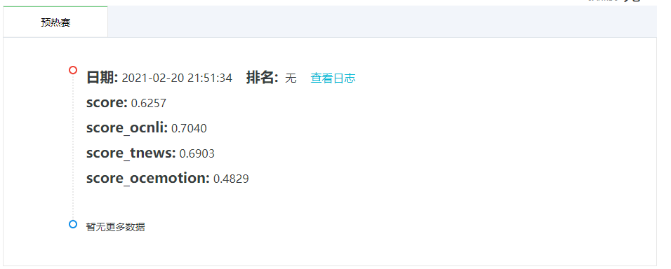

# Task1：比赛全流程体验

- 学习主题：理解赛题内容解题流程
- 学习内容：赛题理解、学习Docker使用
- 学习成果：熟悉流程，将结果提交


## 准备工作

### 个人配置

`操作系统`：Ubuntu1804 Server

`GPU`：TITAN Xp

`环境配置`：

- **显卡驱动版本**：NVIDIA Driver 410.48
- **CUDA、cuDNN版本**：CUDA Version 10.0.130、cuDNN 7.6.5
- **python版本**：3.7
- **pytorch、torchvision版本**：torch 1.2、torchvision 0.4

### [Baseline](https://github.com/finlay-liu/tianchi-multi-task-nlp)（感谢Datawhale提供学习资料）

#### 1. 下载包 transformers

由于服务器配置了 conda 的清华源，所以输入 `conda install transformers` 无法成功安装（猜测清华源不支持该包）。所以还是使用 `pip install transformers` 成功安装。

#### 2. 下载bert

下载 [中文预训练BERT模型](https://huggingface.co/bert-base-chinese/tree/main) `bert-base-chinese`，只需下载`config.json`、`vocab.txt`和`pytorch_model.bin` 三个文件。刚开始点击下载图标无法下载前两个文件，只能点击进去右键另存为到本地；模型文件下载下来是序列号，将其改名为所示名称。

#### 3. 下载数据集

数据集下载链接汇总在此：https://github.com/finlay-liu/tianchi-multi-task-nlp

#### 4. 下载 Baseline 代码

用 `git` 或直接下载都可。

#### 5. 文件结构

最终的文件结构如下：

```
multi_task_nlp
|-----bert_pretrain_model
|     |-----config.json
|     |-----pytorch_model.bin
|     |-----vocab.txt
|
|-----tianchi_datasets
|     |-----OCEMOTION
|           |-----total.csv
|           |-----test.csv
|     |-----OCNLI
|           |-----total.csv
|           |-----test.csv
|     |-----TNEWS
|           |-----total.csv
|           |-----test.csv
|
|-----submission
|     |-----Dockerfile
|     |-----run.sh
|
|-----code（该部分省略）
```

## 运行

### 1. 切分训练集和验证集

`python ./generate_data.py`

由于刚开始没安装包 transformers ，所以导致出错，安装完成后成功运行。

### 2. 训练模型

`python ./train.py`

报出一个非常经典的错误：

```
TypeError: ne() received an invalid combination of arguments - got (NoneType), but expected one of:
* (Tensor other) didn't match because some of the arguments have invalid types: (NoneType) 
* (Number other) didn't match because some of the arguments have invalid types: (NoneType)
```

这是因为在 `calculate_loss.py` 代码中，出现了多次一个对象与 None 进行比较的情况。`None` 在 python 里是一个单例，它在内存中只有一个实例。所以和 `None` 比较时，通常用 `is not` 或 `is` ，尽量不用 `!=` 或 `==`。修改 `calculate_loss.py` 中的代码后，成功运行。

训练 20 个 epoch 之后的结果如下：


### 3. 生成结果

用训练好的模型 `./saved_best.pt` 生成结果：

`python ./inference.py`

### 4. 打包预测结果

`zip -r ./result.zip ./*.json` 或直接将生成的结果 json 文件 压缩到 submission 文件夹下。

文件结构如下：

```
multi_task_nlp
|-----bert_pretrain_model
|     |-----config.json
|     |-----pytorch_model.bin
|     |-----vocab.txt
|
|-----tianchi_datasets
|     |-----OCEMOTION
|           |-----total.csv
|           |-----test.csv
|     |-----OCNLI
|           |-----total.csv
|           |-----test.csv
|     |-----TNEWS
|           |-----total.csv
|           |-----test.csv
|
|-----submission
|     |-----Dockerfile
|     |-----run.sh
|     |-----submit.zip
|
|-----code（该部分省略）
```

## Docker 提交

### 1. 安装

Ubuntu 安装比较容易，[参考教程](https://tianchi.aliyun.com/competition/entrance/231759/tab/174)。

注册阿里云使用镜像服务，创建命名空间和镜像空间，[参考教程](https://tianchi.aliyun.com/competition/entrance/231759/tab/174)

### 2. 推送

切换到 `submission` 文件夹下，执行以下命令构建镜像：

```
# 用于登录的用户名为阿里云账号全名，密码为开通服务时设置的密码。
sudo docker login --username=[阿里云账号全名] registry.cn-hangzhou.aliyuncs.com

# 使用本地Dockefile进行构建，使用创建仓库的【公网地址】
# 如 
docker build -t [自己仓库的地址]:[镜像版本号] .
```

执行以下命令推送到仓库：

```
docker tag [ImageId] [自己仓库的地址]:[镜像版本号]

docker push [自己仓库的地址]:[镜像版本号]
```

### 3. 提交

#### 3.1 提交界面

提交界面如下：


#### 3.2 成绩

初试成绩如下：



## 致谢

感谢 @[Datawhale](https://github.com/datawhalechina) 的学习指导！

## 参考

1. [baseline](https://github.com/finlay-liu/tianchi-multi-task-nlp)
2. [全球人工智能技术创新大赛【热身赛二】](https://tianchi.aliyun.com/competition/entrance/531865/information)
3. [学习爱好者：面包猎人踩坑记录](https://blog.csdn.net/weixin_40807714/article/details/113856151)
4. [阿里云Docker使用教程](https://tianchi.aliyun.com/competition/entrance/231759/tab/174)
5. [Python != operation vs “is not”](https://stackoverflow.com/questions/2209755/python-operation-vs-is-not)

